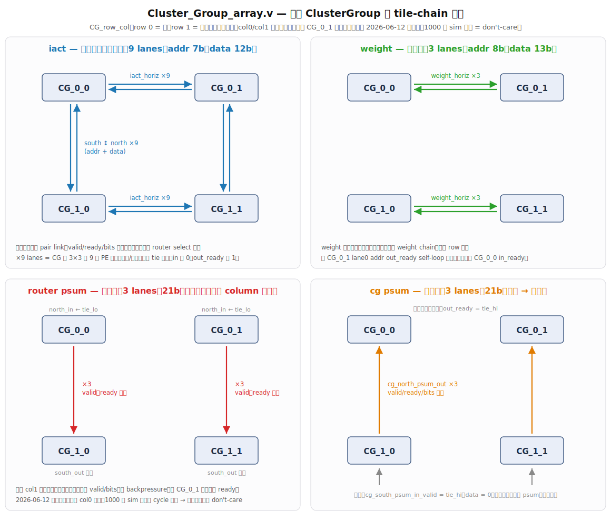

# Cluster_Group_array — 四個 ClusterGroup 的 tile-chain 互連

> **Cluster_Group 階層**。`ClusterGroup_array`（位於 `Cluster_Group_array.v`）例化 **2×2 個 `Cluster_Group`**，每個 CG 內含 **3×3 個 PE**。本層的職責有兩個：把四個 CG 用 **tile-chain** 直連起來，並讓每個 CG 各自對外接 **GLB**。

## 這個資料夾

| 檔案 | 角色 |
|---|---|
| **`Cluster_Group_array.v`** | 本文主角：例化 2×2 CG，定義 CG 之間的 tile-chain 互連 |
| `Cluster_Group.v` | 單顆 CG（內含 3×3 PE + router + GLB） |
| `Cluster_Group_Controller.v` | 產生 CG 的控制訊號 |

## 架構圖

> `CG_row_col` 命名：**row 0 = 北、row 1 = 南**；對角線無接線。**col0／col1 接線完全鏡像對稱**。

## tile-chain 拓樸速覽

四個 CG 之間靠四組訊號互連，方向與規模各不相同：

| 訊號 | 方向 | lanes | 位寬 |
|---|---|---|---|
| **iact** | 垂直＋水平**皆雙向** | 9 | addr 7b + data 12b |
| **weight** | **僅水平** | 3 | addr 8b + data 13b |
| **router psum** | **僅垂直**，南向單鏈 | 3 | 21b |
| **cg psum** | **僅垂直**，南 → 北累加 | 3 | 21b |

- **9 lanes** = CG 內 3×3 的 9 顆 PE 各一條；**3 lanes** = 對應 weight／psum 的 3 路。
- weight **沒有**南北向連線（垂直軸不存在 weight chain），兩個 row 同款。
- 上表是「實體上接了哪些線」；實際資料走向由各 CG 的 **router select** 決定。

## 接線規則

- **source-named 直連**：每條 tile-chain wire 由「驅動端 CG」的 output port 命名，接收端的 connection 直接吃該 wire，**無 `assign` 中繼**（雙方共用同一條 wire）。
- **col0／col1 完全鏡像**：兩個 column 的接法一模一樣。
- **邊緣 tile**（北緣 row0／南緣 row1 無鄰側者）：輸入 `in_valid`／`in_bits` 接 `tie_lo`、`out_ready` 接 `tie_hi`；無人讀的輸出 wire 懸空。
- **唯一例外**：`cg_south_psum_in` 在南緣的 `in_valid` 接 `tie_hi`、`data` 接 `0` —— 底排恆收一筆「有效的零 psum」供向北累加。

## 對外介面（每個 CG）

每個 CG 透過 GLB 介面對外連接：**iact 讀入**（3×3 PE 各一）、**weight 讀入**（3 lanes）、**psum 讀寫**（3 banks，21b signed），外加一組 select／enable 控制訊號。頂層 port 的 `[0:1][0:1]` 索引即對應 2×2 的 CG 位置。

## 備註：CG_0_1 不規則接線已規則化（2026-06-11）

原碼 `CG_0_1` 有三處與其他 CG 不一致的接線：

1. `iact_north` addr 的 `out_ready[0][0]` 寫死 `'d0`
2. `weight` addr 的 `out_ready[0]` self-loop
3. `psum` col1 上下互餵成環、且無 backpressure

已全部改為與 col0 一致的規則接法。**1000 張 MNIST sim 結果與 cycle 完全等價，證實三處皆為 don't-care（原作者筆誤／無作用訊號）。**
