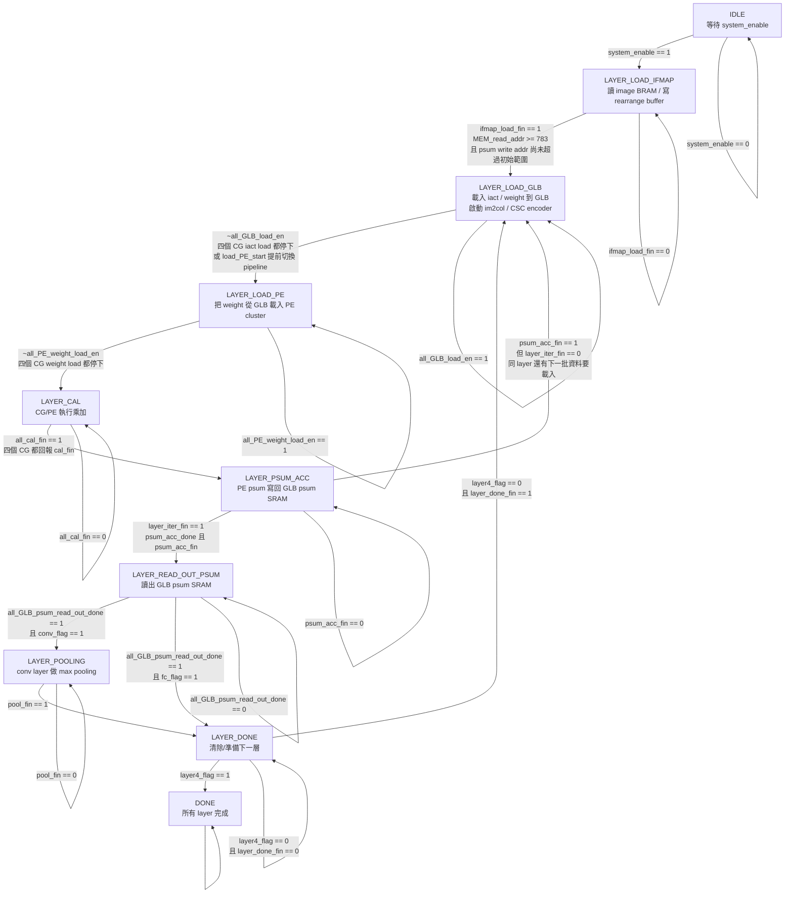

# TOP Controller Flowchart

This document summarizes the control flow implemented in `TOP_controller.v`.
The diagram follows the actual FSM transition logic and the helper signals used
to decide when each state may advance.

## Main FSM

## Transition Reasons

| From | To | Code condition | Meaning |
| --- | --- | --- | --- |
| `IDLE` | `LAYER_LOAD_IFMAP` | `system_enable` | 外部啟動整個 inference。 |
| `LAYER_LOAD_IFMAP` | `LAYER_LOAD_GLB` | `ifmap_load_fin` | `MEM_read_addr >= 783`，表示 28x28 image 的 784 pixels 已讀完；同時用 psum write addr 條件避免初始 rearrange 尚未完成就切走。 |
| `LAYER_LOAD_GLB` | `LAYER_LOAD_PE` | `~all_GLB_load_en` | CG 的 iact load enable 全部停止，或 `load_PE_start` 觸發，代表 GLB 端資料已足夠讓 PE 載 weight。 |
| `LAYER_LOAD_PE` | `LAYER_CAL` | `~all_PE_weight_load_en` | 四個 CG 的 PE weight load enable 全部停止，代表 PE 權重載入完成。 |
| `LAYER_CAL` | `LAYER_PSUM_ACC` | `all_cal_fin` | `CG_0_0/0_1/1_0/1_1_cal_fin` 全部為 1，代表所有 CG 本輪 MAC 結束。 |
| `LAYER_PSUM_ACC` | `LAYER_READ_OUT_PSUM` | `layer_iter_fin` | 本層累積次數達標且 GLB psum write address 到達該層輸出邊界。 |
| `LAYER_PSUM_ACC` | `LAYER_LOAD_GLB` | `psum_acc_fin && !layer_iter_fin` | 目前這一小段 psum 已寫回，但本 layer 還沒完成，需要載下一批 activation/weight 再算。 |
| `LAYER_READ_OUT_PSUM` | `LAYER_POOLING` | `all_GLB_psum_read_out_done && conv_flag` | conv layer 的 GLB psum 全部讀完，下一步送 pooling。 |
| `LAYER_READ_OUT_PSUM` | `LAYER_DONE` | `all_GLB_psum_read_out_done && fc_flag` | FC layer 不做 pooling，讀完 psum 後直接進入 layer done。 |
| `LAYER_POOLING` | `LAYER_DONE` | `pool_fin` | pooling 讀 rearrange buffer 到指定最後 address。Layer0 結束條件是 address 3455，Layer1 是 address 1024。 |
| `LAYER_DONE` | `LAYER_LOAD_GLB` | `!layer4_flag && layer_done_fin` | 非最後 layer，等待 2 cycles 清除/歸零部分 write index 後進入下一層載入。 |
| `LAYER_DONE` | `DONE` | `layer4_flag` | 第 5 層，也就是 `layer_count == 4`，完成後整體 inference 結束。 |

## Helper Condition Details

| Signal | Definition in controller | Role |
| --- | --- | --- |
| `conv_flag` | `layer0_flag \| layer1_flag` | Layer0/1 走 conv path，read psum 後會進 pooling。 |
| `fc_flag` | `layer2_flag \| layer3_flag \| layer4_flag` | Layer2/3/4 走 fully-connected path，read psum 後直接進 layer done。 |
| `all_GLB_load_en` | OR of four `CG_*_GLB_iact_load_en`, masked by `~load_PE_start` | 表示目前仍在載入 GLB iact。變成 0 時 FSM 才能進 `LAYER_LOAD_PE`。 |
| `load_PE_start` | Layer0 依 `GLB_iact_en_sel` 與三個 read flags；Layer1 依 batch/channel；FC 依 weight memory read done | 讓 pipeline 在資料足夠時提前結束 GLB load phase，準備進 PE load。 |
| `all_PE_weight_load_en` | OR of four `CG_*_PE_weight_load_en` | 表示 PE 仍在載入 weight。變成 0 後才開始計算。 |
| `all_cal_fin` | AND of four `CG_*_cal_fin` | 四個 CG 都完成計算才可寫回 psum。 |
| `psum_acc_fin` | 依 layer 使用 GLB psum write addr modulo 邊界判斷 | 表示目前 psum write segment 結束。Layer0 用 `%24==23`，Layer1 用 `%32==31`，FC layers 用 `%4==3`。 |
| `psum_acc_done` | Layer0: 12, Layer1: 6, Layer2: 15, Layer3: 4, Layer4: 1 次 `psum_acc_pulse` | 表示該 layer 需要的累積輪數已達成。 |
| `layer_iter_fin` | `psum_acc_done & psum_acc_fin` | 同時達成累積次數與 psum address 邊界，才代表本 layer 計算階段真的完成。 |
| `all_GLB_psum_read_out_done` | Conv 使用 read_out psum channel/iter/sel counters；FC 使用 GLB psum read addr/channel/batch/sel counters | 表示該 layer 所有 psum 已從 GLB SRAM 讀出。 |
| `pool_fin` | Layer0: `psum_rearrange_read_addr_reg == 3455`; Layer1: `== 1024` | pooling 掃描完成。 |
| `layer_done_fin` | `layer_done_count == 2` | `LAYER_DONE` 停 2 cycles，讓 iact SRAM write index 等控制狀態清空。 |

## Layer-Level Path

| Layer | Type | Actual FSM path |
| --- | --- | --- |
| Layer0 | Conv | `IDLE -> LAYER_LOAD_IFMAP -> LAYER_LOAD_GLB -> LAYER_LOAD_PE -> LAYER_CAL -> LAYER_PSUM_ACC -> LAYER_READ_OUT_PSUM -> LAYER_POOLING -> LAYER_DONE` |
| Layer1 | Conv | `LAYER_DONE -> LAYER_LOAD_GLB -> LAYER_LOAD_PE -> LAYER_CAL -> LAYER_PSUM_ACC -> LAYER_READ_OUT_PSUM -> LAYER_POOLING -> LAYER_DONE` |
| Layer2 | FC | `LAYER_DONE -> LAYER_LOAD_GLB -> LAYER_LOAD_PE -> LAYER_CAL -> LAYER_PSUM_ACC -> LAYER_READ_OUT_PSUM -> LAYER_DONE` |
| Layer3 | FC | `LAYER_DONE -> LAYER_LOAD_GLB -> LAYER_LOAD_PE -> LAYER_CAL -> LAYER_PSUM_ACC -> LAYER_READ_OUT_PSUM -> LAYER_DONE` |
| Layer4 | FC | `LAYER_DONE -> LAYER_LOAD_GLB -> LAYER_LOAD_PE -> LAYER_CAL -> LAYER_PSUM_ACC -> LAYER_READ_OUT_PSUM -> LAYER_DONE -> DONE` |

## Data Path Notes From TOP.v

- `TOP_controller` drives `ctrl_ReLU_en`, `ctrl_pool_enable`, and `ctrl_softmax_en`.
- During conv readout, `ReLU_en = LAYER_READ_OUT_PSUM & conv_flag`; data goes through requantizer/ReLU and is written into `Psum_rearrange`.
- During pooling, `pool_enable = LAYER_POOLING & ~pool_pulse`; pooling reads from `Psum_rearrange` and writes pooled data back to the rearrange buffer for the next layer.
- During Layer4 readout, `softmax_en = LAYER4_READ_OUT_PSUM_reg`; TOP feeds `GLB_psum_out` into `Softmax.v`, and `final_out/final_out_valid` come directly from the softmax argmax output.

