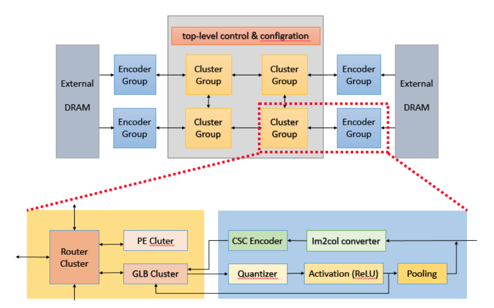

# Deploying LeNet-5 on an Im2col-GEMM-Based Eyeriss v2 Accelerator

本專案基於 **Eyeriss v2** 架構，實作一個針對 **LeNet-5** 推論的**稀疏 CNN FPGA 加速器**，目標平台為 **PYNQ-Z2**（Xilinx Zynq-7020）。

核心設計採用 **im2col + GEMM** 資料流，透過 CSC（Compressed Sparse Column）編碼來跳過零值 activation/weight，搭配硬體化的 ReLU、Max Pooling、Softmax 與 Psum Requantizer，以及一個 per-layer FSM 來排程整個 LeNet-5 的推論流程。

Demo 影片：[Google Drive](https://drive.google.com/file/d/1Kk9X3cwLkhNKud572QUTpbZ3nCjr5gAP/view?resourcekey)


## Environment 
a) Docker container

- Ubuntu 24.04
- Verilator 5.030
- Python 3.11.14，安裝以下套件：
  - torch 2.10.0+cpu
  - torchvision 0.25.0+cpu
  - numpy 1.26.4
  - onnx 1.14.0
  - tvm 0.18.0
  - matplotlib
  - seaborn
  - pandas
  - tqdm
  - scikit-learn
  - pillow

b) FPGA 
- Vivado 2019.1
- Xilinx PYNQ-Z2


## Workflow


本專案從軟體模型訓練與量化開始，接著匯出 `.coe`、`DRAM.txt` 與對應的 golden files，最後進行 RTL simulation 與 FPGA 部署。
本專案會從軟體端開始從 model load 資料集開始
重新訓練以後產生對應的.coe 以及 DRAM.txt 還有
對應的兩種 GOLDEN.txt，放到對應的位置就可以用自己訓練出的權重以及輸入資料

詳見 : [docs/software_user_guideline.md](docs/software_user_guideline.md)


**要執行RTL simulation 走到路徑**
`FPGA_design/sim/verilator` 路徑以下並參考Makefile 執行
指令 (包含int4 以及int8  兩種精度的模擬)

詳見 : [FPGA_design/sim/verilator/Makefile](FPGA_design/sim/verilator/Makefile)

## 快速開始
### Verilator 模擬

```bash
cd FPGA_design/sim/verilator
make sim ITERS=5
```

### 常用指令 : 

| 目的 | 指令 |
| --- | --- |
| INT8 baseline | `make clean && make sim ITERS=5` |
| INT4 sign-extend + requant | `make clean && make sim ITERS=5 INT4_REGEN=1 INT4_REQUANT=14_7` |
| INT4 packed single-lane | `make clean && make sim ITERS=5 INT4_PACKED=1 INT4_REQUANT=14_7` |
| INT4 packed two-lane | `make clean && make sim ITERS=5 INT4_PACKED_TWO_LANE=1 INT4_REQUANT=14_7` |
| INT4 packed SIMD2 | `make clean && make sim ITERS=5 INT4_PACKED_SIMD2=1 INT4_REQUANT=14_7` |
| 產生 VCD waveform | `make trace START=0` |


### 更換測試資料

```bash
make sim ITERS=5 \
  DRAM=../../test/tb/TOP_test/MEM/DRAM.txt \
  GOLDEN=../../test/tb/TOP_test/MEM/GOLDEN.txt \
  COE_FILE=../../Vivado/PYNQ_Z2/PYNQ_Z2.ip_user_files/mem_init_files/ROM_sparse_COE.coe
```

### FPGA 驗證
**要執行FPGA的應用驗證 走到路徑**
`host_demo` 並參考 Readme.md 執行指令

```bash
cd host_demo
pip install pyserial pillow numpy
python fpga_uart_demo.py
```

詳細接線與操作請參閱 [`host_demo/README.md`](host_demo/README.md)。

### FPGA 上板驗證

FPGA 之部署與上板驗證於 `develop` 分支完成，可重建之 Vivado 專案位於該分支 [`FPGA_design/Vivado/NCKU_AOC_Team/`](https://github.com/NCKU-AOC-Team/Deploying-VGG-16-on-an-Im2col-GEMM-Based-Eyeriss-v2-Accelerator/tree/develop/FPGA_design/Vivado/NCKU_AOC_Team)，重現前請切換至 `develop`。環境需 Vivado 2019.1 與 PYNQ-Z2（`xc7z020clg400-1`），主機端需 Python 及 `pyserial`、`pillow`、`numpy`，並以 3.3V USB-to-UART 連接開發板。重現可直接以 Vivado Hardware Manager 燒錄預建 bitstream（`FPGA_design/Vivado/NCKU_AOC_Team/build/eyeriss_develop.runs/impl_1/TOP_integration_uart.bit`，LeNet-5 權重已固化於 ROM，燒錄不需 `.coe`），或以 `setup_project.tcl` 重建專案後依序執行 Synthesis、Implementation 與 Generate Bitstream。燒錄後執行 `host_demo/fpga_uart_demo.py`，選擇 COM 埠連線並送出手寫數字影像（UART 115200 baud、8N1，每次固定 784 bytes，28×28），辨識結果以開發板 LED（4-bit 二進位類別）呈現，應與 Demo 影片一致。

## Repository 結構

| 路徑 | 內容 |
| --- | --- |
| `software/` | 訓練 / 量化 / 匯出工具鏈（PyTorch）：`LeNet.py`、PACT QAT、`.coe` ROM 產生、histogram 分析 |
| `FPGA_design/src/` | Verilog RTL：TOP、GLB、Router、Cluster Group、PE、Spad、Pooling、Quantizer |
| `FPGA_design/sim/verilator/` | Verilator 模擬環境（Makefile + C++ harness + behavioral BRAM），約 79x 快於 Vivado xsim |
| `FPGA_design/test/tb/TOP_test/` | 測試資料：DRAM、golden label、ROM/COE |
| `FPGA_design/tools/` | INT4 / sparse ROM 產生腳本 |
| `FPGA_design/Vivado/PYNQ_Z2/` | Vivado 專案（synthesis / implementation / bitstream） |
| `docs/` | 架構文件（詳見下方說明） |
| `host_demo/` | PC 端 Tkinter GUI，透過 UART 將手寫數字送到 FPGA 推論 |

---


## Docs 文件說明

| 檔案 | 說明 |
| --- | --- |
| [`docs/module_reference.md`](docs/module_reference.md) | RTL 模組速查表：每個模組的職責、上下游連接、對應優化工作包（權重載入、per-MAC pipeline、dataflow mapping） |
| [`docs/software_user_guideline.md`](docs/software_user_guideline.md) | 軟體到硬體的完整工作流程：執行 `LeNet.py` 訓練/量化、匯出 `DRAM.txt`/`GOLDEN.txt`/`.coe`、整合至 FPGA、使用 `draw_hist.py` 視覺化量化偏移 |
| [`docs/top_controller_fsm.md`](docs/top_controller_fsm.md) | `TOP_controller` 的 9-state FSM 詳解（IDLE → LOAD_IFMAP → LOAD_GLB → LOAD_PE → CAL → PSUM_ACC → READ_OUT_PSUM → POOLING → DONE），標示每層的排程瓶頸與優化切入點 |
| [`docs/pe_utilization_analysis.md`](docs/pe_utilization_analysis.md) | PE 使用率與逐層 cycle 分析：MAC 僅佔 PE 週期的 2.8%，FC 層瓶頸為權重載入（87-90%），3x3 PE 陣列存在 2.7x 負載不平衡 |
| [`docs/unified_int8_int4_runtime_mode.md`](docs/unified_int8_int4_runtime_mode.md) | INT8/INT4 統一 runtime 模式設計：從 compile-time 切換改為單一 bitstream 同時支援 INT8 與 INT4 packed SIMD2，透過 `int4_weight_mode` 訊號動態選擇 |


## 架構總覽



## Software 工具鏈

位於 `software/` 目錄：

| 檔案 | 功能 |
| --- | --- |
| `LeNet.py` | 主腳本：FP32 訓練 LeNet-5、INT8/INT4/PACT QAT、匯出硬體所需檔案 |
| `draw_hist.py` | 繪製 optimal requantization shift 的 histogram |

---

## Host Demo

`host_demo/` 提供一個 Tkinter GUI（`fpga_uart_demo.py`），可讓使用者在畫布上手寫數字，透過 UART 傳送 784 bytes 到 PYNQ-Z2，並在開發板的 LED 或七段顯示器上即時顯示分類結果。

詳細使用說明請參閱 [`host_demo/README.md`](host_demo/README.md)。

## Contribution

本專案完整的從軟體端採用了PACT_QAT 這類在低精度可以去除離均值(Outlier)的量化方式 完整的訓練的一個LeNet-5的模型，並且可以把對應的資料放到RTL 端進行雙精度的驗證，最終部屬在一個FPGA (PYNQ-Z2) 下做出了一個應用。**硬體端主要分別在下面四個地方有貢獻** : 

 - Fusion : 整合 ReLU 與 Max Pooling 的後處理流程，減少中間資料寫回、讀取與額外狀態切換。
 - PE : 優化 PE 的 MAC 與 partial sum 更新流程，搭配 banked Psum Spad 降低資料相依與寫回等待。
 - SIMD : 將兩組 INT4 weight/count 封裝於同一筆資料中，讓兩個 lane 共用 activation 並執行雙路乘加運算。
 - Clamping : 在 requantization 後加入 signed saturation，將超出範圍的結果限制在 [-128, 127]，避免 overflow 造成數值反轉。


**軟體端的主要貢獻**是在 INT4 低位元量化下，採用 PACT-QAT 對 ifmap activation 進行量化。透過學習 clipping threshold，降低 outlier 對量化範圍的影響，使有限的 INT4 quantization levels 能更集中於主要資料分布，提供更細緻的量化解析度，進而提升整體推論正確率。


## References
[1] J. Choi, Z. Wang, S. Venkataramani, P. I.-J. Chuang, V. Srinivasan, and K. Gopalakrishnan, “PACT:
Parameterized clipping activation for quantized neural networks,” arXiv preprint arXiv:1805.06085,
2018.

[2] S. Han, H. Mao, and W. J. Dally, “Deep Compression: Compressing Deep Neural Networks with
Pruning, Trained Quantization and Huffman Coding,” in Proc. Int. Conf. Learn. Representations
(ICLR), 2016.

[3] Y.-H. Chen, T.-J. Yang, J. Emer, and V. Sze, “Eyeriss v2: A Flexible Accelerator for Emerging Deep
Neural Networks on Mobile Devices,” IEEE Journal on Emerging and Selected Topics in Circuits
and Systems, vol. 9, no. 2, pp. 292–308, June 2019, doi: 10.1109/JETCAS.2019.2910232.
